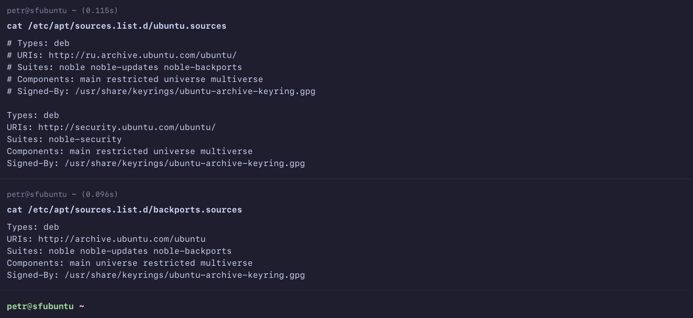
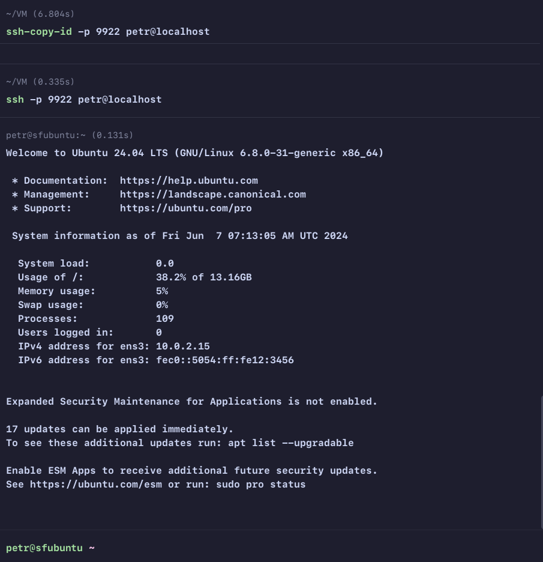
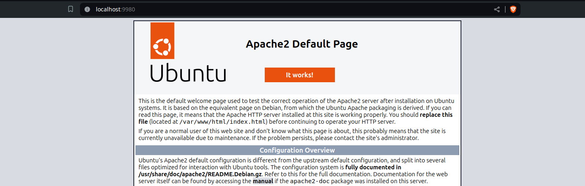
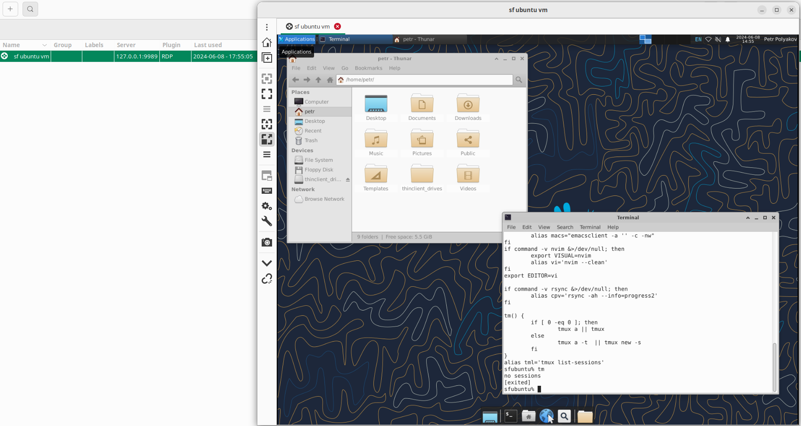
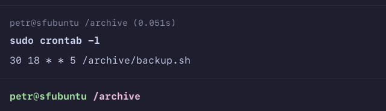
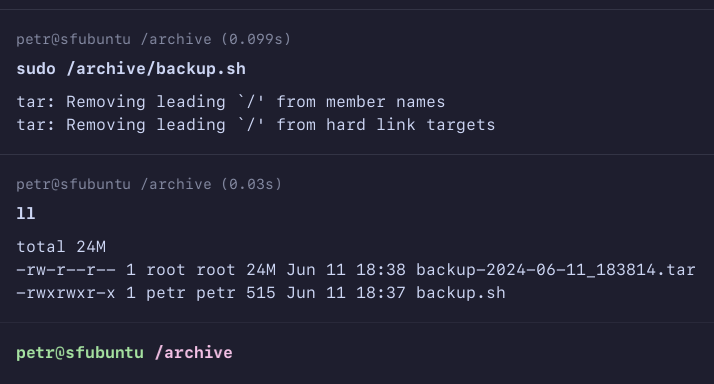
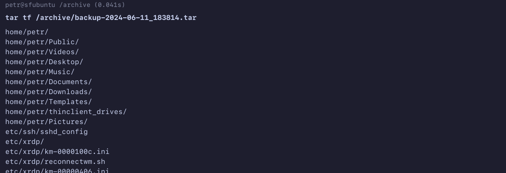
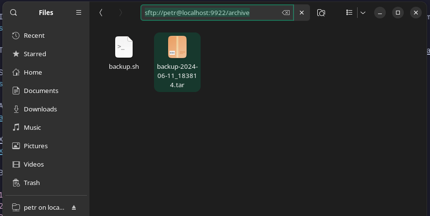
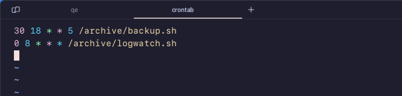
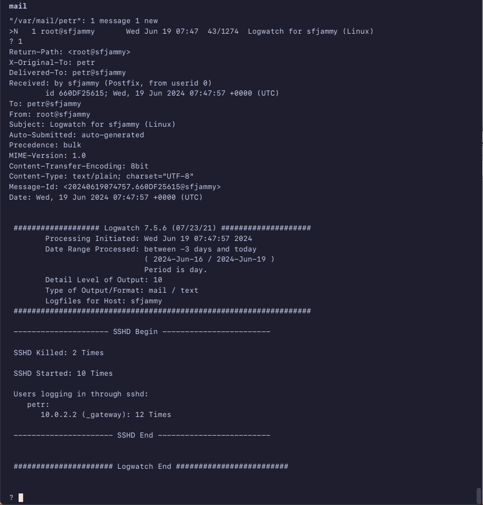

# OS 03. Administrating GNU Linux

> Homework for MIFI/SF InfoSec courses

There are two folders: [babaseline](./baseline/) and [sophisticated](./sophisticated/). Please look at the baseline. Sophisticated contains some experiments I want to keep saved.

## [Rollout](./baseline/rollout.sh)

Everything specified in this section configured automatically just running this from server:
```bash
# run directly form server:
curl https://raw.githubusercontent.com/XelorR/sf_infosec_os_03_administrating-linux/main/baseline/rollout.sh | bash -
```

It will check if backports enabled and enable if not. [Baseline](./baseline/rollout.sh) script works for **Ubuntu Jammy**, [sophisticated](./sophisticated/rollout.sh) is working new **Ubuntu Noble** syntax. Screenshot made for Noble, but there is no much difference, it works for Jammy also.


Then it will update the system and install some packages, including required (python, apache, ssh)

SSH will be enabled as required, key will be generated if not exists, then You will be able to connect:


Apache will be enabled and launched:


Bonus 5 features:

1. latest **NeoVim** version will be downloaded, unpacked and symlinked
2. latest **lf** file manager version will be found with curl and sed, then downloaded and unpacked
3. zsh will be installed and set as user's default shell
4. GUI (xfce4) will be installed to server, RDP will be configured to login to XFCE4

5. .zshrc will be created with some custom content


## [Backup](./baseline/backup.sh)

This command will create backup script, create cron job and run it for a first time:
```bash
# run directly form server:
curl https://raw.githubusercontent.com/XelorR/sf_infosec_os_03_administrating-linux/main/baseline/backup.sh | bash -
```

Cron job will be added automatically:


Archive will be created with some exclusions, to make it lighter:






## [Logging](./baseline/logging.sh)

This command will save logwatch command into script and add the cronjob, then run it for a first time:
```bash
# run directly form server:
curl https://raw.githubusercontent.com/XelorR/sf_infosec_os_03_administrating-linux/main/baseline/logging.sh | bash -
```

Cron job will be added:


Email will be received with on cronjob/script run

